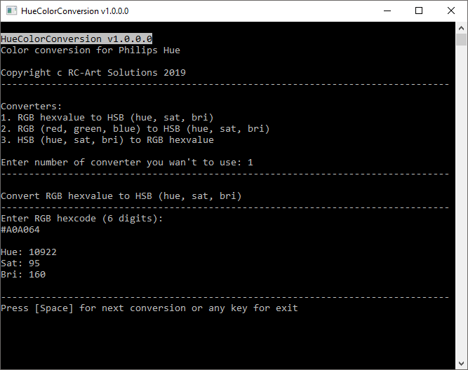

# HueColorConversion

Console application to convert rgb hexvalues to hsb values.

## How to use

### Use the program
Enter a rgb hexvalue with 6 digets and press enter ;)

## Screenshoot

## Releases
This project build on the continuous integration (CI) platform [AppVeyor](https://www.appveyor.com/) and released in the [Release-Feed](https://github.com/100prznt/HueColorConversion/releases).

  

  
 (Pre-)Release

## Credits

* **Elias Ruemmler** - *Initial work* - [rmmlr](https://github.com/rmmlr)

Under [Contributors](https://github.com/100prznt/HueColorConversion/contributors) you can see more project supporter.

### Open Source Project Credits

* [Q42.HueApi.ColorConverters](https://github.com/Q42/Q42.HueApi) Bedienung der Hue-API

## License

This project (HueColorConversion) is licensed under  [MIT License](http://www.opensource.org/licenses/mit-license.php "Read more about the MIT license form").  
Refer to [LICENSE.txt](https://github.com/100prznt/HueColorConversion/blob/master/LICENSE.txt) for more information.

 
